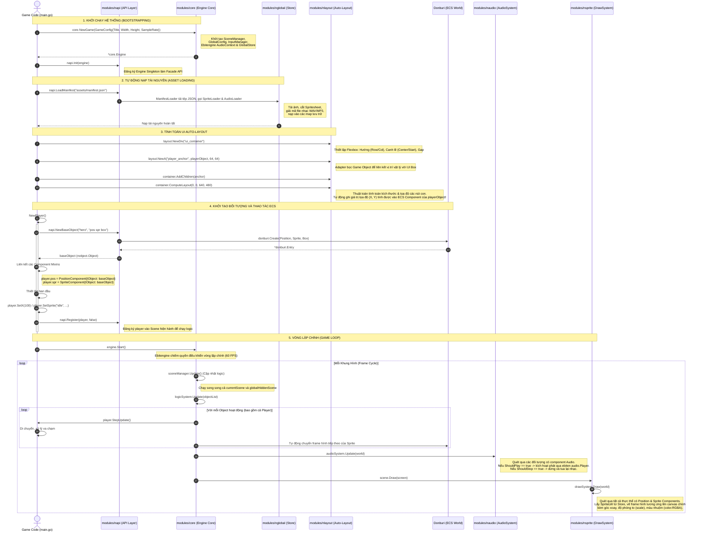

# Toàn Cảnh Thiết Kế Kiến Trúc AutoWorld Engine

Tài liệu này cung cấp cái nhìn toàn diện nhất về thiết kế hệ thống và cấu trúc vận hành của **toàn bộ dự án AutoWorld Engine**, bao gồm cả lõi ECS (Donburi), hệ thống UI Auto-Layout (`nlayout`), hệ thống nạp tài nguyên (`nasset`), âm thanh (`naudio`), hiển thị (`nsprite`), và API Facade (`napi`).

---

## 1. Biểu đồ UML Toàn Hệ Thống (Full-Scale UML Class Diagram)

Biểu đồ này thể hiện đầy đủ các interface trong `domain`, các struct thực thi tương ứng trong các `modules`, và cách chúng liên kết với nhau qua hai thư viện nền tảng là **Ebitengine** và **Donburi**.

```mermaid
classDiagram
    direction TB

    %% ==========================================
    %% DOMAIN INTERFACES (Tầng giao ước lõi)
    %% ==========================================
    class IObject {
        <<interface>>
        +StepUpdate()
        +Destroy()
        +Entry() *donburi.Entry
    }

    class IPosition {
        <<interface>>
        +X() float32
        +Y() float32
        +SetX(x float32)
        +SetY(y float32)
    }

    class ISprite {
        <<interface>>
        +SpriteIdx() int
        +SetSpriteIdx(idx int)
        +ImageSpeed() float32
        +SetImageSpeed(speed float32)
        +Rotation() float32
        +SetRotation(r float32)
        +ScaleX() float32
        +SetScaleX(sx float32)
        +ScaleY() float32
        +SetScaleY(sy float32)
        +Sprite(name string) ISpriteLW
        +SetSprite(name string, sprite ISpriteLW)
        +NextImage()
        +ImageIndex() int
        +SetImageIndex(idx int)
    }

    class IBox {
        <<interface>>
        +BoxW() float32
        +SetBoxW(w float32)
        +BoxH() float32
        +SetBoxH(h float32)
        +BoxX() float32
        +SetBoxX(x float32)
        +BoxY() float32
        +SetBoxY(y float32)
        +IsCollidable() bool
        +SetIsCollidable(c bool)
        +Shape() BoxShape
        +SetShape(s BoxShape)
    }

    class IAudio {
        <<interface>>
        +Audio() IAudioLW
        +SetAudio(name string, audio IAudioLW)
        +AudioName() string
        +SetAudioName(name string)
        +Play(name string, vol, pitch float32)
        +PlayDefault(name string)
        +StopAudio()
    }

    class IScene {
        <<interface>>
        +Update() error
        +Draw()
        +Destroy()
    }

    class ISceneManager {
        <<interface>>
        +Update() error
        +Draw() error
        +Layout(outsideWidth, outsideHeight int) (screenWidth, screenHeight int)
        +ChangeSceneFromList(id string) error
        +ChangeSceneForce(next IScene) error
        +GetCurrentScene() IScene
        +GetSceneFromList(id string) IScene
        +GetGlobalScene() IScene
        +AddScene(id string, scene IScene) error
        +RemoveScene(id string) error
        +RemoveAllScene() error
    }

    class IGlobal {
        <<interface>>
        +GetSprite(key string) ISpriteLW
        +AddSprite(key string, sprite ISpriteLW)
        +UpdateSprite(key string, sprite ISpriteLW)
        +GetAudio(key string) IAudioLW
        +AddAudio(key string, audio IAudioLW)
        +UpdateAudio(key string, audio IAudioLW)
        +GetObject(key string) IObject
        +AddObject(key string, object IObject)
        +UpdateObject(key string, object IObject)
        +GetVar(key string) any
        +NewVar(key string, value any)
        +UpdateVar(key string, value any)
        +GetConst(key string) any
        +NewConst(key string, value any)
        +UpdateConst(key string, value any)
    }

    class IGlobalConfig {
        <<interface>>
        +GetConfig() IGlobalConfig
        +NotifyChange()
        +AddObserver(observer IObserver)
        +RemoveObserver(observer IObserver)
        +SetValue(key string, value any)
        +GetValue(key string) any
    }

    class IObserver {
        <<interface>>
        +NotifyChange(config IGlobalConfig)
    }

    class IInputManager {
        <<interface>>
    }

    class ILayout {
        <<interface>>
        +SetBoxH(h int)
        +SetBoxW(w int)
        +SetBoxX(x int)
        +SetBoxY(y int)
        +BoxH() int
        +BoxW() int
        +BoxX() int
        +BoxY() int
        +AddChildren(children ILayout)
        +RemoveChildren(children ILayout)
        +Childrens() []ILayout
        +GetChildrenByName(name string) ILayout
        +Name() string
        +SetName(name string)
        +IsVisible() bool
        +SetIsVisible(isVisible bool)
        +SetLayoutConfig(config int)
        +LayoutConfig() int
        +SetGap(gap int)
        +Gap() int
        +ComputeLayout(parentX, parentY, parentW, parentH int)
    }

    class ILogicSystem {
        <<interface>>
        +Update(objectList []IObject)
    }

    class IDrawSystem {
        <<interface>>
        +Draw(w donburi.World)
        +SetScreen(s *ebiten.Image)
    }

    class IAudioSystem {
        <<interface>>
        +Update(w donburi.World)
    }

    class ISpriteLoader {
        <<interface>>
        +LoadSingle(path string) (ISpriteLW, error)
        +LoadSheet(path string, frameW, frameH, cols, rows, gapX, gapY int) (ISpriteLW, error)
    }

    class IAudioLoader {
        <<interface>>
        +Load(path string) (IAudioLW, error)
    }

    class IManifestLoader {
        <<interface>>
        +LoadFromFile(filePath string, store IGlobal) error
    }

    %% ==========================================
    %% ENGINE MODULE CONCRETE STRUCTURES
    %% ==========================================
    
    %% modules/core
    class Engine {
        +Scene *SceneManager
        +Config *GlobalConfig
        +Input *InputManager
        +Store IGlobal
        +AudioCtx *audio.Context
        +Start(title string, w, h int)
    }

    class SceneManager {
        -scenes map[string]IScene
        -currentScene IScene
        -globalScene IScene
        +Update() error
        +Draw() error
        +Layout(ow, oh int) (sw, sh int)
    }
    ISceneManager <|.. SceneManager : implements

    class Scene {
        -world donburi.World
        -drawSystem *nsprite.DrawSystem
        -logicSystem ILogicSystem
        -objectList []IObject
        +Update() error
        +Draw()
        +Destroy()
        +World() donburi.World
    }
    IScene <|.. Scene : implements

    class GlobalConfig {
        -observers []IObserver
        -data map[string]any
        +NotifyChange()
        +AddObserver(o IObserver)
    }
    IGlobalConfig <|.. GlobalConfig : implements

    class InputManager {
        +Update()
    }
    IInputManager <|.. InputManager : implements

    %% modules/nglobal
    class GlobalStore {
        <<singleton>>
        -sprites map[string]ISpriteLW
        -audios map[string]IAudioLW
        -objects map[string]IObject
        -vars map[string]any
        -consts map[string]any
        +GetSprite(key string) ISpriteLW
        +GetAudio(key string) IAudioLW
    }
    IGlobal <|.. GlobalStore : implements

    %% modules/nobject
    class Object {
        -entry *donburi.Entry
        +StepUpdate()
        +Destroy()
        +Entry() *donburi.Entry
    }
    IObject <|.. Object : implements

    class LogicSystem {
        +Update(objectList []IObject)
    }
    ILogicSystem <|.. LogicSystem : implements

    %% modules/nsprite & modules/naudio
    class DrawSystem {
        -screen *ebiten.Image
        +Draw(w donburi.World)
        +SetScreen(s *ebiten.Image)
    }
    IDrawSystem <|.. DrawSystem : implements

    class AudioSystem {
        -audioCtx *audio.Context
        +Update(w donburi.World)
    }
    IAudioSystem <|.. AudioSystem : implements

    %% modules/nasset
    class SpriteLoader {
        +LoadSingle(path string) (ISpriteLW, error)
    }
    ISpriteLoader <|.. SpriteLoader : implements

    class AudioLoader {
        -audioCtx *audio.Context
        +Load(path string) (IAudioLW, error)
    }
    IAudioLoader <|.. AudioLoader : implements

    class ManifestLoader {
        -spriteLoader ISpriteLoader
        -audioLoader IAudioLoader
        +LoadFromFile(path string, store IGlobal) error
    }
    IManifestLoader <|.. ManifestLoader : implements

    %% modules/nlayout (Hệ thống UI Auto-Layout)
    class Div {
        -name string
        -x, y, w, h int
        -childrens []ILayout
        -layoutConfig int
        -gap int
        +ComputeLayout(px, py, pw, ph int)
    }
    ILayout <|.. Div : implements

    class A {
        -object IObject
        -x, y, w, h int
        +ComputeLayout(px, py, pw, ph int)
    }
    ILayout <|.. A : implements
    A *-- IObject : wraps

    %% modules/components (Component Mixins)
    class PositionComponent {
        +IObject base
        +X() float32
        +SetX(x float32)
    }
    IPosition <|.. PositionComponent : implements

    class SpriteComponent {
        +IObject base
        +SpriteIdx() int
        +SetSpriteIdx(idx int)
    }
    ISprite <|.. SpriteComponent : implements

    class BoxComponent {
        +IObject base
        +BoxW() float32
    }
    IBox <|.. BoxComponent : implements

    class AudioComponent {
        +IObject base
        +Play(name string, vol, pitch float32)
    }
    IAudio <|.. AudioComponent : implements

    %% bridge
    class SpriteLW {
        -images []*ebiten.Image
        -width, height int
        +Image(idx int) *ebiten.Image
    }
    ISpriteLW <|.. SpriteLW : implements

    %% GAME RELATIONSHIPS
    Engine *-- SceneManager : holds
    Engine *-- GlobalConfig : holds
    Engine *-- InputManager : holds
    Engine *-- GlobalStore : holds
    SceneManager *-- Scene : manages
    Scene *-- DrawSystem : uses
    Scene *-- LogicSystem : uses
    Scene *-- donburi.World : wraps
```

---

## 2. Phân Tầng Hệ Thống (Architecture Layers Diagram)

Biểu đồ dưới đây chia rõ AutoWorld Engine thành **5 tầng kiến trúc** tách biệt, thể hiện các package thực tế, vai trò cụ thể của chúng và nguyên tắc tham chiếu dữ liệu.

```mermaid
graph TD
    classDef layer1 fill:#f9f,stroke:#333,stroke-width:2px;
    classDef layer2 fill:#bbf,stroke:#333,stroke-width:2px;
    classDef layer3 fill:#dfd,stroke:#333,stroke-width:2px;
    classDef layer4 fill:#fdd,stroke:#333,stroke-width:2px;
    classDef layer5 fill:#ffd,stroke:#333,stroke-width:2px;

    %% LAYERS DEF
    subgraph L1 ["Tầng 1: Lập trình Game Logic & Đối tượng Custom (Game Code)"]
        GameMain["main.go (Setup & Vòng lặp)"]
        GameEntities["Custom Entities (Player, Enemy, Boss, UI Hud...)"]
    end
    class L1 layer1;

    subgraph L2 ["Tầng 2: Game Logic API Facade (napi)"]
        NAPI_Game["Game.go (Singleton Engine)"]
        NAPI_Scene["Scene.go (Scene management wrappers)"]
        NAPI_Obj["ObjectHelper.go (Token-based creation)"]
        NAPI_Store["StoreHelper.go (Asset, Audio, Variables)"]
        NAPI_Reg["Register.go (Token Registry & NewComponentType)"]
    end
    class L2 layer2;

    subgraph L3 ["Tầng 3: Engine Core & UI Component Mixins"]
        CORE_Engine["core.Engine (Trái tim của Game)"]
        CORE_SM["core.SceneManager (Quản lý đa màn chơi)"]
        CORE_Scene["core.Scene (Cảnh chơi chứa ECS World)"]
        COMP_Mix["modules/components (Position, Sprite, Box, Audio Components)"]
        NLAYOUT["modules/nlayout (UI Auto-Layout: Div, A, ILayout)"]
    end
    class L3 layer3;

    subgraph L4 ["Tầng 4: Phân hệ Kỹ thuật (Subsystems & Helpers)"]
        NGLOBAL["modules/nglobal (Global Store chứa Sprite/Audio nạp lên)"]
        NASSET["modules/nasset (Asset Loader đơn & Sheet, Manifest JSON Reader)"]
        NOBJECT["modules/nobject (Object base, LogicSystem điều phối StepUpdate)"]
        NSPRITE["modules/nsprite (DrawSystem dựng hình từ ECS)"]
        NAUDIO["modules/naudio (AudioSystem kích phát âm thanh)"]
    end
    class L4 layer4;

    subgraph L5 ["Tầng 5: Core Domain & Bridges (Không phụ thuộc bất kỳ ai)"]
        DOMAIN_Interfaces["domain (IObject, IScene, IGlobal, ILayout...)"]
        DOMAIN_Data["domain (PositionData, SpriteData, BoxData, AudioData structs)"]
        BRIDGE_LW["domain/bridge (轻量级/Lightweight wrappers như SpriteLW)"]
    end
    class L5 layer5;

    %% IMPORT DIRECTIONS
    L1 --> L2
    L1 --> L3
    
    L2 --> L3
    L2 --> L4
    
    L3 --> L4
    L3 --> L5
    
    L4 --> L5
```

---

## 3. Quy Trình Khởi Chạy & Luồng Tích Hợp (Full Integration Flow Diagram)

Biểu đồ tuần tự dưới đây thể hiện toàn bộ các bước hoạt động thực tế của Game:
1.  **Bootstrapping**: Khởi tạo Engine, Store, Cấu hình.
2.  **Asset Loading**: Nạp toàn bộ ảnh, nhạc từ manifest JSON vào bộ nhớ.
3.  **UI Layout Setup**: Xây dựng cấu trúc UI Auto-Layout dựa trên Flexbox, liên kết Game Object với Adapter `A` để tính toán tọa độ tự động.
4.  **Custom Object Setup**: Tạo Player đính kèm các ECS component bằng mã token `"pos spr box"` và liên kết Mixin.
5.  **Vòng lặp Game (Game Loop)**: Cập nhật sự kiện, xử lý hoạt ảnh sprite, kiểm tra trạng thái phát nhạc và vẽ lên canvas.

